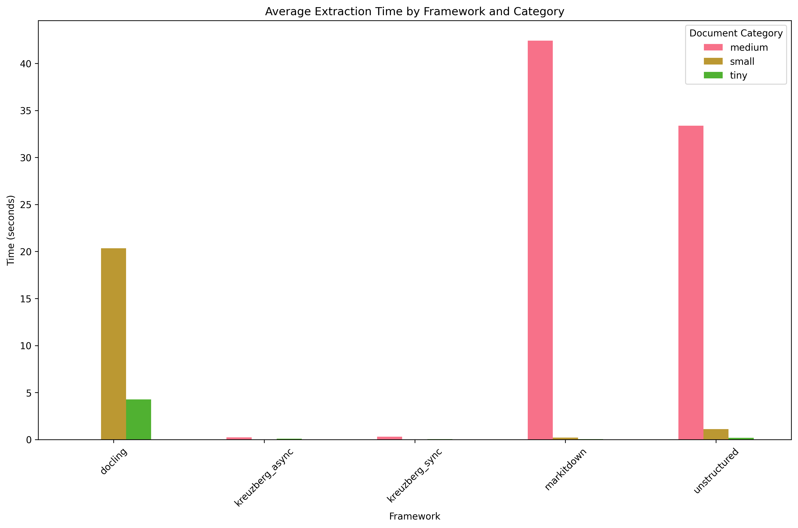
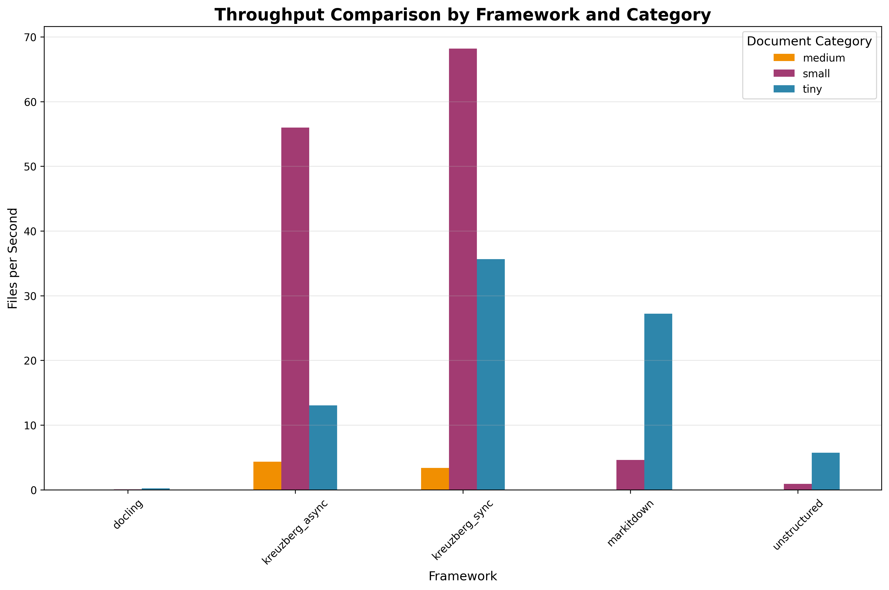
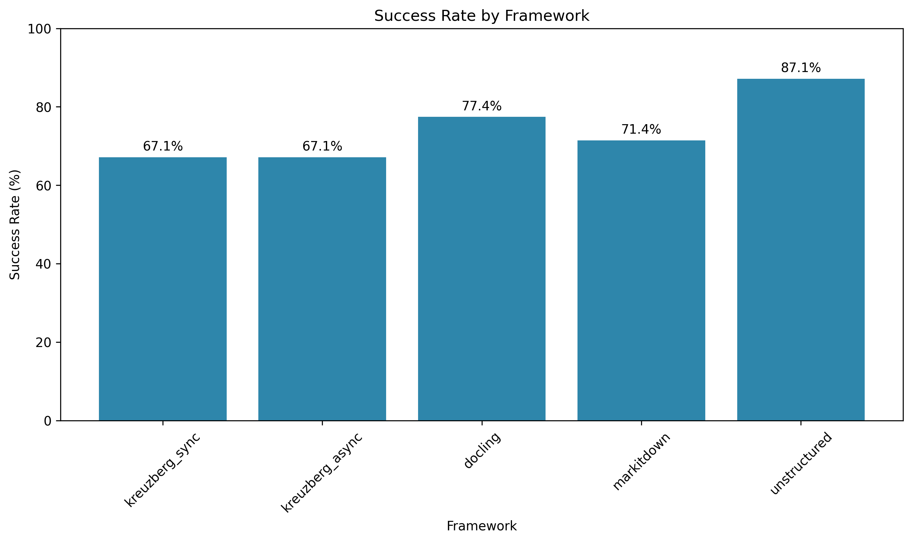
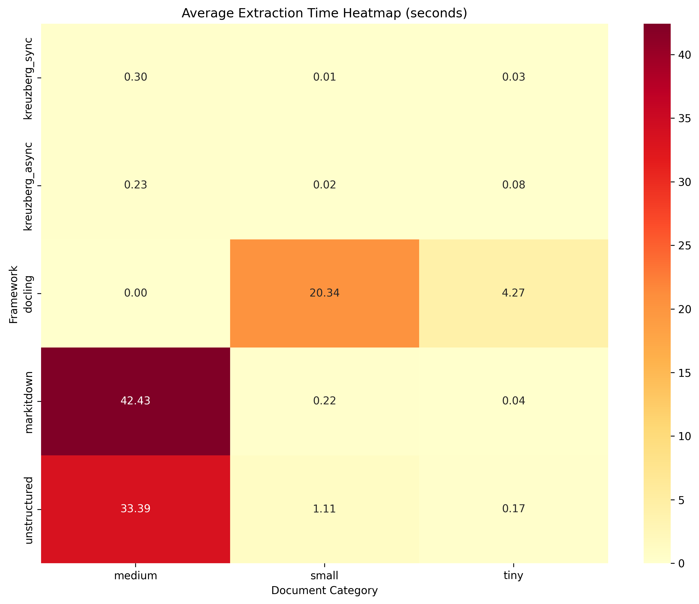
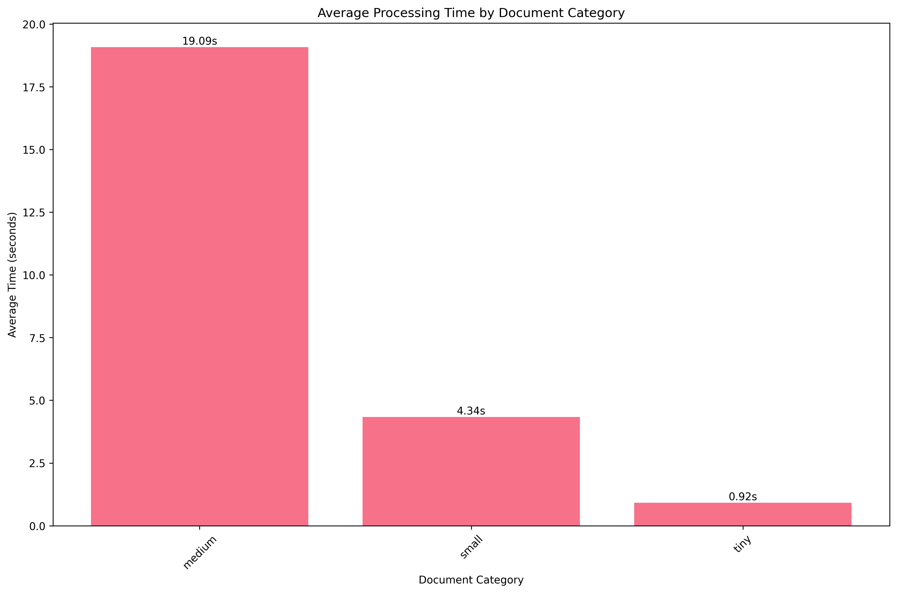

# Python Text Extraction Libraries Benchmarks 2025

## 📊 Latest Benchmark Results

*Last updated: 2025-07-04 18:04:05 UTC*
*Run ID: 16077011603*

### Summary

- **Total Files Processed:** 1,026
- **Total Processing Time:** 5573.8 seconds
- **Frameworks Tested:** 5
- **Document Categories:** 3
- **Best Performing Framework:** unstructured

### Framework Performance

| Framework       | Success Rate | Avg Time | Total Files | Status |
| --------------- | ------------ | -------- | ----------- | ------ |
| kreuzberg_sync  | 67.1%        | 0.11s    | 210         | 🔴     |
| kreuzberg_async | 67.1%        | 0.11s    | 210         | 🔴     |
| docling         | 77.4%        | 12.30s   | 186         | 🟡     |
| markitdown      | 71.4%        | 14.23s   | 210         | 🟡     |
| unstructured    | 87.1%        | 11.56s   | 210         | 🟡     |

### Visualizations

📊 **[Interactive Dashboard](visualizations/interactive_dashboard.html)** - Comprehensive interactive analysis

#### Performance Charts

- 
- 

#### Analysis

- 
- 
- 
- 

### Download Reports

For detailed analysis, download the comprehensive reports:

- 📋 [Markdown Report](reports/benchmark_report.md)
- 📊 [JSON Metrics](reports/benchmark_metrics.json)
- 🌐 [HTML Report](reports/benchmark_report.html)

______________________________________________________________________

> **🎯 [📊 VIEW LIVE BENCHMARK RESULTS →](https://goldziher.github.io/python-text-extraction-libs-benchmarks/)**

Automated performance benchmarking of Python text extraction frameworks with real-time updates.

## 🏆 What You'll Find in the Results

- **⚡ Performance Comparison** - Speed, memory usage, and success rates across all frameworks
- **📊 Interactive Charts** - Visual breakdowns by file type, size category, and framework
- **🔍 Detailed Metrics** - Per-file results, error analysis, and resource utilization
- **📱 Live Dashboard** - Real-time updates when new framework versions are released

*Benchmarks run on 94 documents (210MB) across PDF, DOCX, HTML, images and 6 languages*

## 🧪 Tested Frameworks

- **[Kreuzberg](https://github.com/Goldziher/kreuzberg)** - Ultra-fast async/sync extraction with OCR backends (Tesseract, EasyOCR, PaddleOCR)
- **[Docling](https://github.com/docling-project/docling)** - IBM's deep learning document processor with advanced ML features
- **[MarkItDown](https://github.com/microsoft/markitdown)** - Microsoft's LLM-optimized converter with ONNX runtime
- **[Unstructured](https://github.com/Unstructured-IO/unstructured)** - Enterprise ETL solution supporting 64+ file types

## 🚀 Quick Start

```bash
git clone https://github.com/Goldziher/python-text-extraction-libs-benchmarks
cd python-text-extraction-libs-benchmarks
uv sync --dev

# Run all benchmarks
uv run python -m src.cli benchmark

# Test specific framework
uv run python -m src.cli benchmark --framework kreuzberg_sync --category small
```

## 📋 Benchmark Details

**Test Dataset:** 94 documents (210MB) - PDF, DOCX, HTML, images across 6 languages
**Categories:** Tiny (\<100KB), Small (100KB-1MB), Medium (1MB-10MB), Large (10MB-50MB)
**Methodology:** Isolated CI jobs, 3 iterations, comprehensive metrics, timeout protection

**What Makes This Unique:**

- 🔄 **Auto-updating** - New framework versions trigger fresh benchmarks
- 🏃 **Fault-tolerant** - Fast frameworks aren't blocked by slow ones
- 📊 **Comprehensive** - Speed, memory, success rates, error analysis
- 🌍 **Real-world** - Multi-language, varied formats, edge cases

## 🤝 Contributing

Want to add a new framework? Just update `src/extractors.py` and `src/types.py`, then submit a PR!

______________________________________________________________________

**MIT License** | *Auto-updating benchmarks on GitHub Actions (Ubuntu, CPU-only)*
