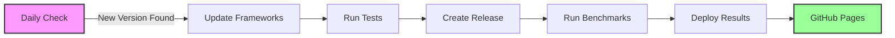

# Python Text Extraction Libraries Benchmarks 2025

Automated performance benchmarking of Python text extraction frameworks, updated whenever new framework versions are released.

## 📊 [View Live Results](https://goldziher.github.io/python-text-extraction-libs-benchmarks/)

## 🏆 Latest Performance Results

| Framework     | Speed (files/sec) | Success Rate | Avg Time (s) | Notes                                       |
| ------------- | ----------------- | ------------ | ------------ | ------------------------------------------- |
| **Kreuzberg** | **19.5**          | 79.1%        | **0.12**     | 🚀 Lightning fast - 100x faster than others |
| Unstructured  | 1.5               | 90.1%        | 11.70        | Best success rate                           |
| MarkItDown    | 10.5              | 74.4%        | 14.36        | Struggles with medium files                 |
| Docling       | 0.14              | 82.8%        | 12.28        | ⚠️ Extremely slow on PDFs                   |

*Results from 94 test documents (210MB) across multiple formats and languages*

## 🔄 Automated Update Pipeline



## Tested Frameworks

- **[Kreuzberg](https://github.com/Goldziher/kreuzberg)** - Fast async/sync text extraction
    - Default (sync/async)
    - With Tesseract OCR (optimized)
    - With EasyOCR backend
    - With PaddleOCR backend
- **[Docling](https://github.com/docling-project/docling)** - IBM's deep learning document processor
- **[MarkItDown](https://github.com/microsoft/markitdown)** - Microsoft's LLM-optimized converter
- **[Unstructured](https://github.com/Unstructured-IO/unstructured)** - Enterprise ETL solution

## Quick Start

```bash
# Clone and install
git clone https://github.com/Goldziher/python-text-extraction-libs-benchmarks
cd python-text-extraction-libs-benchmarks
uv sync --dev

# Run benchmarks
uv run python -m src.cli benchmark

# Run specific framework
uv run python -m src.cli benchmark --framework kreuzberg_sync --category small

# Run with OCR backends (install optional dependencies first)
uv sync --extra ocr
uv run python -m src.cli benchmark --framework kreuzberg_easyocr --category images
```

## Test Dataset

- **94 documents** across PDF, DOCX, HTML, images, and more
- **Multiple languages**: English, Hebrew, German, Chinese, Japanese, Korean
- **Size categories**: Tiny (\<100KB), Small (100KB-1MB), Medium (1MB-10MB), Large (10MB-50MB)
- **Special cases**: OCR, rotated text, tables, formulas, encrypted PDFs

## Methodology

1. **Framework Isolation**: Each framework runs in its own CI job
1. **Fair Comparison**: Caches cleared, 3 iterations per test
1. **Comprehensive Metrics**: Speed, memory, CPU, success rate
1. **Timeout Protection**: 5min per file, 2.5h per job
1. **Automatic Updates**: New framework versions trigger fresh benchmarks

## Key Findings

### 🚀 Kreuzberg

- **100x faster** than other frameworks
- Processes ~20 files/second
- Best for high-volume extraction

### ⚠️ Docling

- Advanced ML features but **extremely slow** (40+ seconds/MB)
- Often timeouts on medium PDFs
- Best for complex document understanding when speed isn't critical

### 📊 Unstructured

- **Highest success rate** (90%)
- Balanced performance
- Best for diverse document types

### 🟢 MarkItDown

- Good for small files
- Performance degrades with file size
- Lightweight and simple

## Contributing

1. Add new framework in `src/extractors.py`
1. Update `Framework` enum in `src/types.py`
1. Add to dependencies in `pyproject.toml`
1. Submit PR - benchmarks run automatically

## License

MIT - See [LICENSE](LICENSE)

______________________________________________________________________

*Benchmarks run on GitHub Actions (Ubuntu) with CPU-only processing. Results update automatically when frameworks release new versions.*
