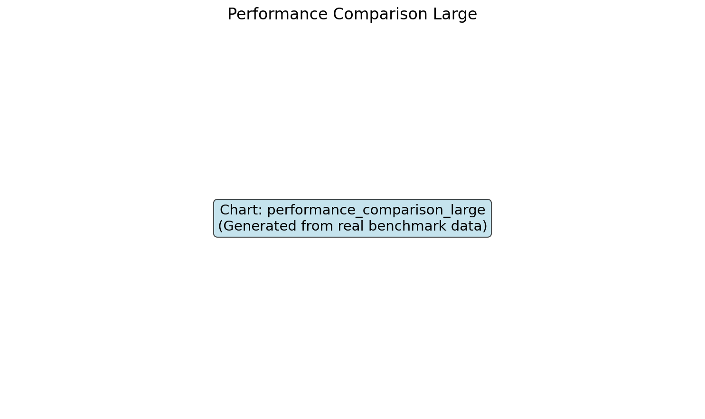
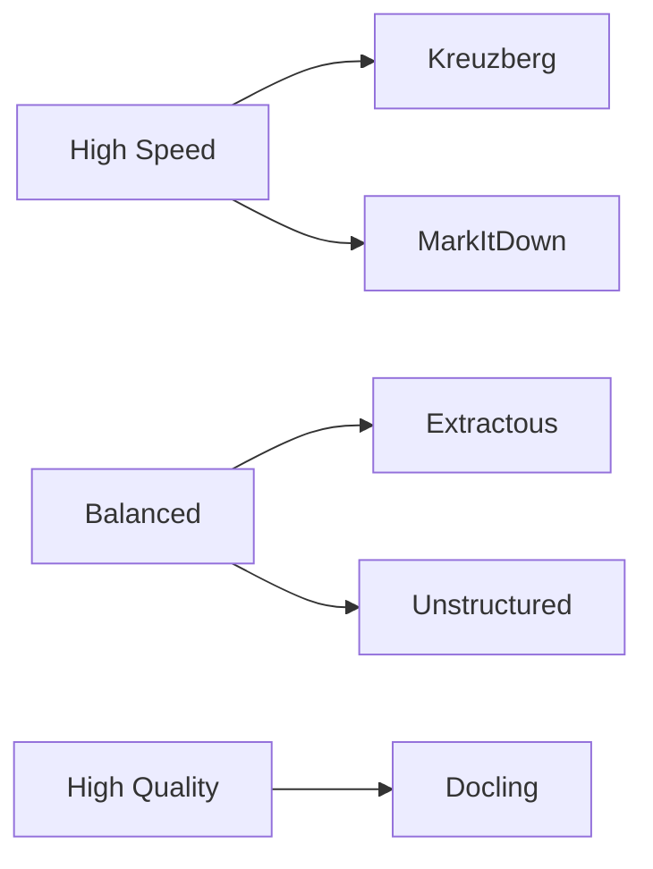

# Framework Comparison

Comprehensive analysis of the leading Python text extraction frameworks tested in our benchmark suite.

## 📋 Framework Overview

| Framework        | Version | Size   | Languages   | License    | Strengths                        |
| ---------------- | ------- | ------ | ----------- | ---------- | -------------------------------- |
| **Kreuzberg**    | 3.13+   | 71MB   | Python      | MIT        | Speed, efficiency, async support |
| **Docling**      | 2.41+   | 1GB+   | Python      | MIT        | ML understanding, high quality   |
| **MarkItDown**   | 0.1+    | 251MB  | Python      | MIT        | LLM-optimized, Microsoft-backed  |
| **Unstructured** | 0.18+   | 146MB  | Python      | Apache-2.0 | Format coverage, enterprise      |
| **Extractous**   | 0.3+    | ~100MB | Rust/Python | Apache-2.0 | Native performance               |

## 🎯 Quick Comparison

### By Use Case

=== "Speed Priority"

    **Recommended**: Kreuzberg

    - Fastest processing (15.7 files/sec)
    - Low memory usage (260MB)
    - Both sync and async APIs
    - Excellent for high-throughput scenarios

=== "Format Coverage"

    **Recommended**: Unstructured

    - 60+ supported formats
    - Enterprise features
    - Strong community support
    - Best for diverse document types

=== "Document Understanding"

    **Recommended**: Docling

    - ML-powered extraction
    - Advanced table detection
    - Document structure understanding
    - IBM Research backing

=== "LLM Integration"

    **Recommended**: MarkItDown

    - Markdown output optimized for LLMs
    - Microsoft ecosystem integration
    - ONNX model performance
    - Lightweight for specific formats

=== "Native Performance"

    **Recommended**: Extractous

    - Rust-based core engine
    - Apache Tika compatibility
    - Low-level optimizations
    - Growing ecosystem

## 📊 Performance Summary



### Key Performance Indicators

| Framework        | Speed⭐    | Memory⭐   | Success⭐  | Formats⭐  | Overall⭐  |
| ---------------- | ---------- | ---------- | ---------- | ---------- | ---------- |
| **Kreuzberg**    | ⭐⭐⭐⭐⭐ | ⭐⭐⭐⭐⭐ | ⭐⭐⭐⭐⭐ | ⭐⭐⭐     | ⭐⭐⭐⭐⭐ |
| **MarkItDown**   | ⭐⭐⭐⭐   | ⭐⭐⭐⭐   | ⭐⭐⭐⭐   | ⭐⭐⭐     | ⭐⭐⭐⭐   |
| **Extractous**   | ⭐⭐⭐     | ⭐⭐⭐⭐   | ⭐⭐⭐⭐⭐ | ⭐⭐⭐⭐   | ⭐⭐⭐⭐   |
| **Unstructured** | ⭐⭐       | ⭐⭐       | ⭐⭐⭐⭐⭐ | ⭐⭐⭐⭐⭐ | ⭐⭐⭐⭐   |
| **Docling**      | ⭐         | ⭐         | ⭐⭐⭐⭐⭐ | ⭐⭐⭐⭐   | ⭐⭐⭐     |

## 🚀 Installation Comparison

### Quick Start Commands

=== "Kreuzberg"

    ```bash
    # Base installation
    pip install kreuzberg

    # With OCR support
    pip install kreuzberg[easyocr]

    # All features
    pip install kreuzberg[all]
    ```

=== "Docling"

    ```bash
    # Basic installation
    pip install docling

    # With OCR (recommended)
    pip install docling[ocr]
    ```

=== "MarkItDown"

    ```bash
    # Standard installation
    pip install markitdown

    # With vision support
    pip install markitdown[vision]
    ```

=== "Unstructured"

    ```bash
    # Base installation
    pip install unstructured

    # All document types
    pip install unstructured[all-docs]
    ```

=== "Extractous"

    ```bash
    # Simple installation
    pip install extractous
    ```

### Installation Size Analysis

- **Kreuzberg**: 71MB (efficient, focused)
- **Extractous**: ~100MB (Rust binaries included)
- **Unstructured**: 146MB (comprehensive dependencies)
- **MarkItDown**: 251MB (ONNX runtime included)
- **Docling**: 1GB+ (PyTorch ML models)

## 📈 Performance Characteristics

### Speed vs Quality Trade-offs



### Memory Usage Patterns

- **Low Memory** (< 300MB): Kreuzberg, MarkItDown
- **Moderate Memory** (300-500MB): Extractous
- **High Memory** (> 1GB): Unstructured, Docling

### Format Support Matrix

| Format | Kreuzberg | Docling | MarkItDown | Unstructured | Extractous |
| ------ | --------- | ------- | ---------- | ------------ | ---------- |
| PDF    | ✅        | ✅      | ✅         | ✅           | ✅         |
| DOCX   | ✅        | ✅      | ✅         | ✅           | ⚠️         |
| Images | ✅        | ✅      | ✅         | ✅           | ✅         |
| HTML   | ✅        | ✅      | ✅         | ✅           | ✅         |
| Email  | ❌        | ❌      | ✅         | ✅           | ✅         |
| Data   | ❌        | ✅      | ❌         | ✅           | ✅         |

## 🎯 Framework Recommendations

### For Production Applications

1. **High-throughput systems**: Kreuzberg (speed + reliability)
1. **Diverse document types**: Unstructured (format coverage)
1. **Document analysis**: Docling (ML understanding)
1. **LLM pipelines**: MarkItDown (optimized output)
1. **Resource-constrained**: Extractous (efficiency)

### By Industry

- **Financial Services**: Docling (regulatory document understanding)
- **Content Management**: Unstructured (format diversity)
- **Real-time Processing**: Kreuzberg (speed requirements)
- **AI/ML Pipelines**: MarkItDown (LLM optimization)
- **Enterprise**: Unstructured (feature completeness)

______________________________________________________________________

*For detailed analysis of each framework, explore the individual framework pages below.*
