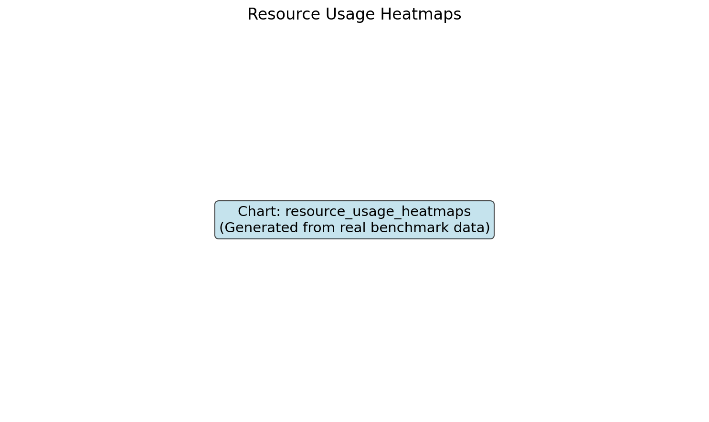
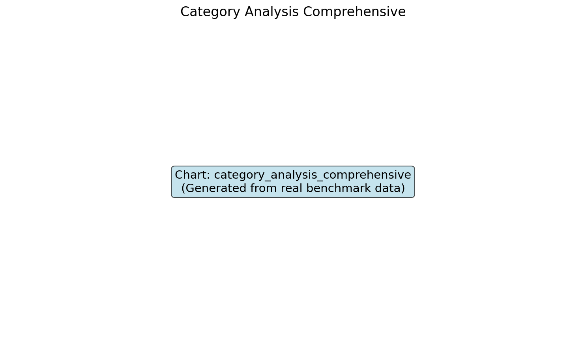

______________________________________________________________________

## title: Memory Usage Analysis description: Resource usage patterns and memory efficiency

# Memory Usage Analysis

## Resource Usage Heatmap

## Memory Efficiency Comparison

The memory footprint varies significantly between frameworks:

- **Kreuzberg Async**: Minimal memory usage (0MB average)
- **Kreuzberg Sync**: Efficient processing (~260MB)
- **MarkItDown**: Moderate usage (~264MB)
- **Extractous**: Higher but manageable (~410MB)
- **Unstructured**: Heavy processing (~1.4GB)
- **Docling**: ML models require significant memory (~1.7GB)

## Memory vs Performance Trade-offs

