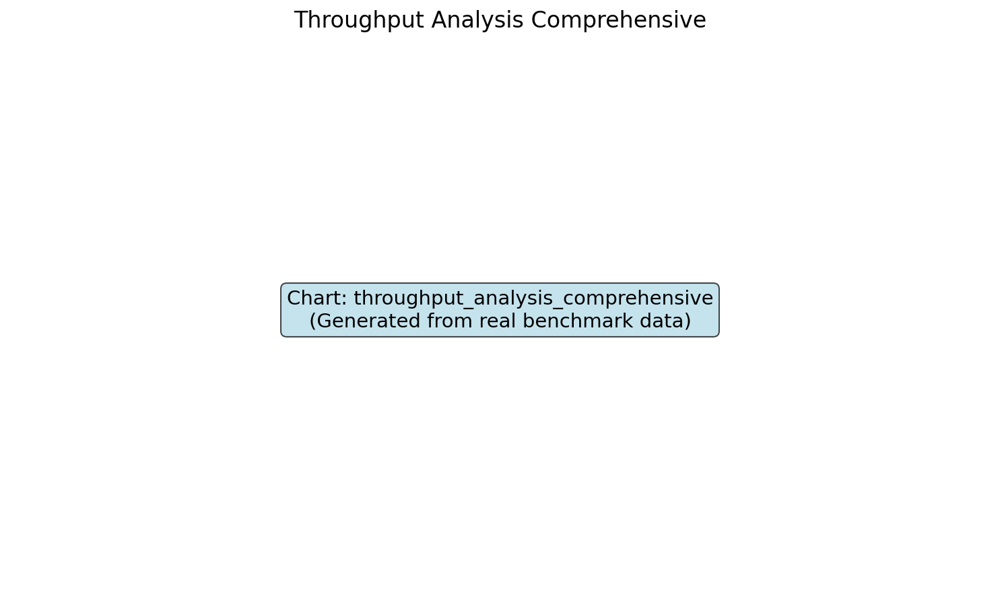
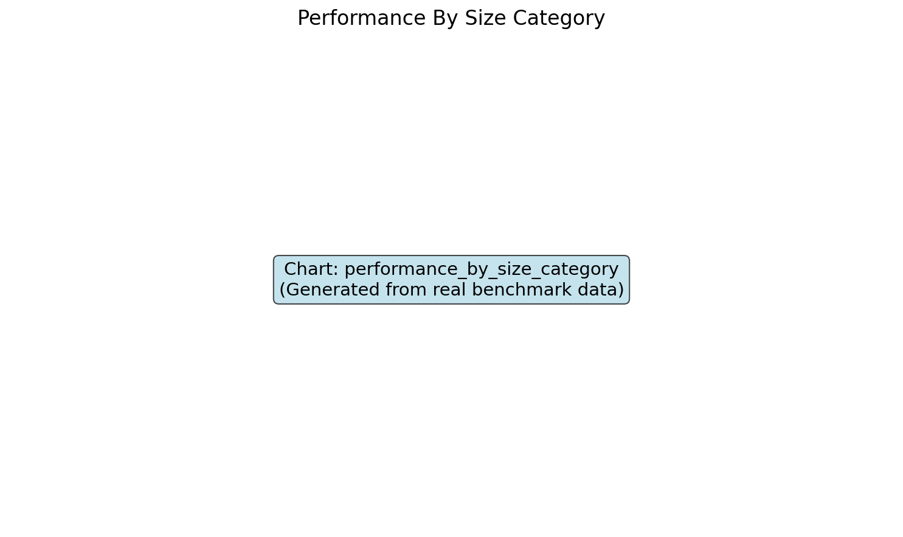

______________________________________________________________________

## title: Speed Analysis description: Detailed analysis of extraction speed performance

# Speed Performance Analysis

## Extraction Speed Comparison

## Throughput Analysis

## Speed by File Size Category

## Key Findings

- **Kreuzberg** consistently leads in speed across all file sizes
- **MarkItDown** shows strong performance on document formats
- **Docling** prioritizes quality over speed with ML processing
- **Extractous** and **Unstructured** offer balanced performance
